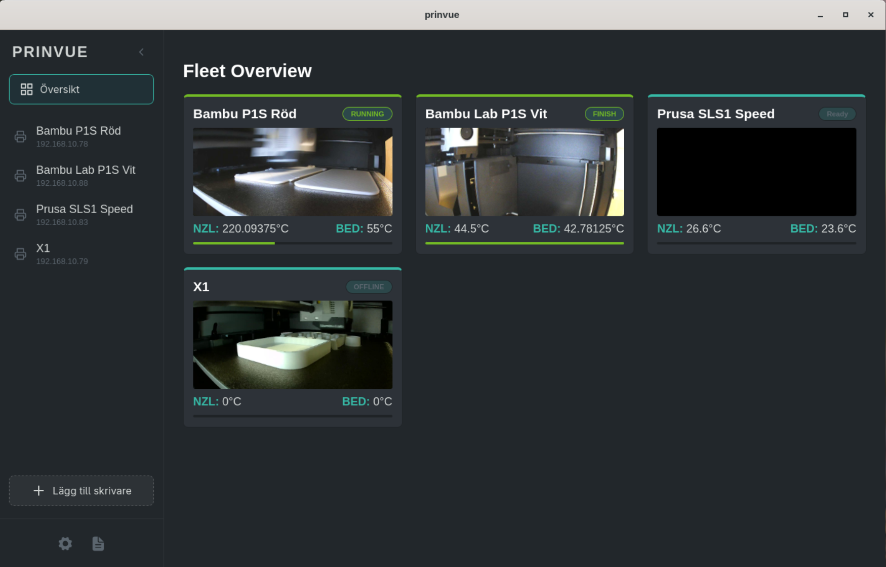

# Prinvue - 3D Printer Management Desktop App

A modern desktop application for managing and monitoring 3D printers. Built with React, TypeScript, and Tauri for cross-platform compatibility. (For now the only language avalable is Swedish, English is comming soon.)

## Features

- Modern, responsive desktop UI built with React
- Multi-printer dashboard with real-time status
- Configurable printer management
- Built-in documentation viewer
- Fast performance with Tauri
- Secure communication with backend
- Works on Windows, macOS, and Linux

## Tech Stack

- **React** - UI library
- **TypeScript** - Type-safe development
- **Tauri** - Cross-platform desktop framework
- **Vite** - Lightning-fast build tool
- **React Markdown** - Documentation rendering
- **React Syntax Highlighter** - Code highlighting
- **React Icons** - Icon library

## Screenshots

The application includes:
- **Dashboard**: Overview of all connected printers with status cards
- **Settings**: Configure backend server URL and preferences
- **Documentation**: Built-in guides for connecting different printer models

### Installation

- Comming soon